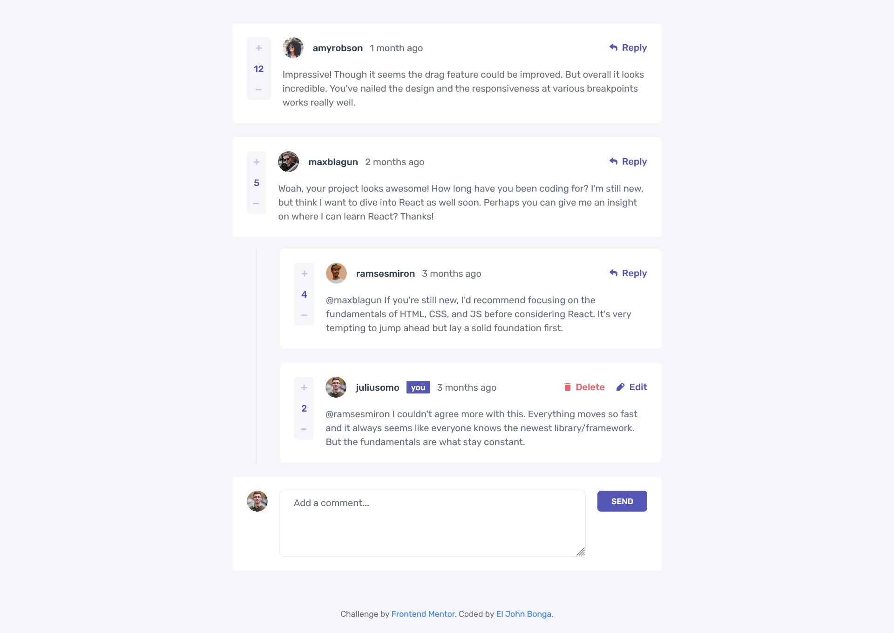

# Frontend Mentor - Interactive comments section solution

This is a solution to the [Interactive comments section challenge on Frontend Mentor](https://www.frontendmentor.io/challenges/interactive-comments-section-iG1RugEG9). Frontend Mentor challenges help you improve your coding skills by building realistic projects.

## Table of contents

- [Overview](#overview)
  - [The challenge](#the-challenge)
  - [Screenshot](#screenshot)
  - [Links](#links)
- [My process](#my-process)
  - [Built with](#built-with)
  - [What I learned](#what-i-learned)
  - [Continued development](#continued-development)
- [Author](#author)

## Overview

### The challenge

Users should be able to:

- View the optimal layout for the app depending on their device's screen size
- See hover states for all interactive elements on the page
- Create, Read, Update, and Delete comments and replies
- Upvote and downvote comments
- **Bonus**: If you're building a purely front-end project, use `localStorage` to save the current state in the browser that persists when the browser is refreshed.
- **Bonus**: Instead of using the `createdAt` strings from the `data.json` file, try using timestamps and dynamically track the time since the comment or reply was posted.

### Screenshot

### Links

- Solution URL: [https://github.com/eljohn316/frontendmentor-challenges-hub/tree/main/challenges/interactive-comments-section](https://github.com/eljohn316/frontendmentor-challenges-hub/tree/main/challenges/interactive-comments-section)
- Live Site URL: [https://interactive-comments-section-app.vercel.app/](https://interactive-comments-section-app.vercel.app/)

## My process

### Built with

- HTML
- TypeScript
- [React](https://reactjs.org/) - JS library
- [TailwindCSS](https://tailwindcss.com/) - for styling
- [Dexie.js (A Minimalistic Wrapper for IndexedDB)](https://dexie.org/) - for Storage

### What I learned

The challenge suggested to use `localStorage` as storage but I opted to use `IndexedDB` instead. But I find its API too complicated. So, I searched for wrappers that would worked well with React. This lead to me discover `Dexie.js` (a minimalistic wrapper for IndexedDB) it was quiet easy to setup and its API is pretty easy and intuitive to use which exactly what I was looking for.

### Continued development

I'm planning to expand this into a Full Stack Project in the future and implement toast notifications for whenever a user creates, updates, or deletes a comment or reply.

## Author

- Frontend Mentor - [@eljohn316](https://www.frontendmentor.io/profile/eljohn316)
- Github - [@eljohn316](https://github.com/eljohn316)
