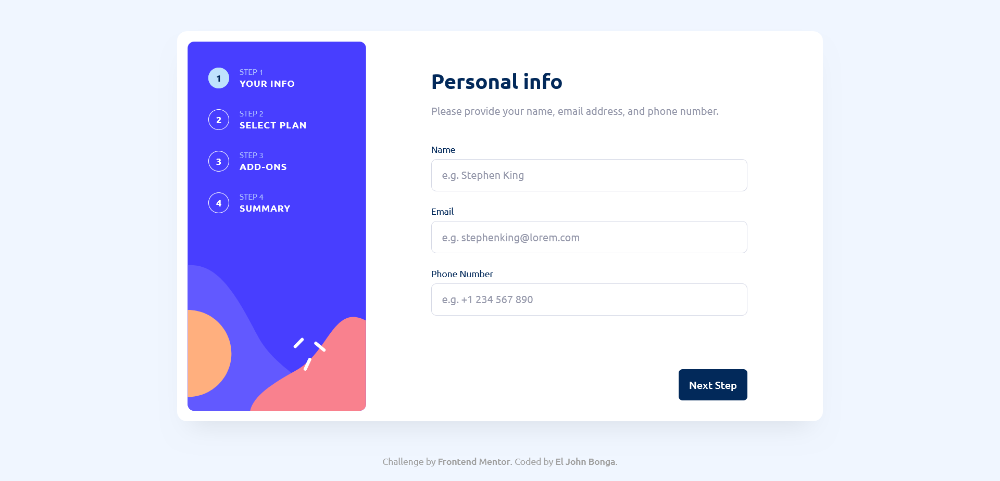

# Frontend Mentor - Multi-step form solution

This is a solution to the [Multi-step form challenge on Frontend Mentor](https://www.frontendmentor.io/challenges/multistep-form-YVAnSdqQBJ). Frontend Mentor challenges help you improve your coding skills by building realistic projects.

## Table of contents

- [Overview](#overview)
  - [The challenge](#the-challenge)
  - [Screenshot](#screenshot)
  - [Links](#links)
- [My process](#my-process)
  - [Built with](#built-with)
  - [What I learned](#what-i-learned)
  - [Useful resources](#useful-resources)
- [Author](#author)

## Overview

### The challenge

Users should be able to:

- Complete each step of the sequence
- Go back to a previous step to update their selections
- See a summary of their selections on the final step and confirm their order
- View the optimal layout for the interface depending on their device's screen size
- See hover and focus states for all interactive elements on the page
- Receive form validation messages if:
  - A field has been missed
  - The email address is not formatted correctly
  - A step is submitted, but no selection has been made

### Screenshot

### Links

- Solution URL: [https://github.com/eljohn316/frontendmentor-challenges-hub/tree/main/challenges/multi-step-form](https://github.com/eljohn316/frontendmentor-challenges-hub/tree/main/challenges/multi-step-form)
- Live Site URL: [https://multi-step-form-navy-nu.vercel.app/](https://multi-step-form-navy-nu.vercel.app/)

## My process

### Built with

- [Next.js](https://nextjs.org/) - React framework
- [Tailwind CSS](https://tailwindcss.com/) - For styling
- [React Hook Form](https://react-hook-form.com/) - For form validation

### What I learned

Although I already had experience using React Hook Form for form validation, this challenge provided a valuable opportunity to refine and enhance my existing skills with the library.

### Useful resources

- [shadcn/ui](https://ui.shadcn.com/) -This helped me style form inputs, radio buttons, and checkboxes since shadcn/ui provides many beautifully designed, accessible example components.

## Author

- Frontend Mentor - [@eljohn316](https://www.frontendmentor.io/profile/eljohn316)
- Github - [@eljohn316](https://github.com/eljohn316)
